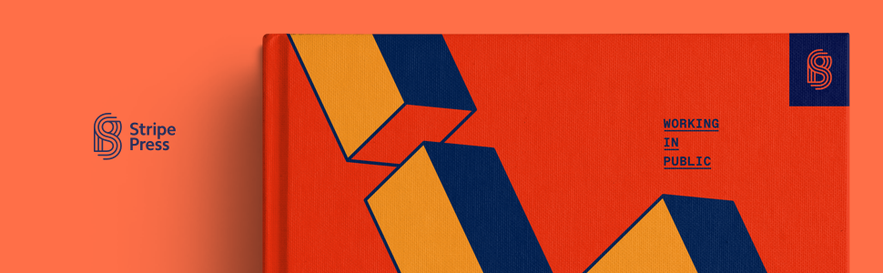

# Dev Book Club: Working in public

## Working in public: *The making and maintenance of open source software.*

By [Nadia Eghbal](https://www.goodreads.com/author/show/15901359.Nadia_Eghbal) 

⭐️ ⭐️ ⭐️ ⭐️ (4.24)
• 📖 [Stripe Press](https://press.stripe.com/) 
• 📱 [Kindle](https://amzn.to/3ohZkpU)
• 📦 [Amazon](https://amzn.to/3oewXJs)
• 📚 [Goodreads](https://www.goodreads.com/book/show/54140556-working-in-public)
• 🔎 [ISBN0578675862](https://isbnsearch.org/isbn/0578675862) 

> *"An inside look at modern open source software developers--and their applications to, and influence on, our online social world."*

## TL;DR

1. Read a chapter a week *(only 5 chapters!)*
2. Add mini chapter reviews for discussion and/or comment on other reviews listed below.
3. Reward yourself for completing a book with new friends 🏆

👋 Welcome to Dev Book Club

[💬 General Discussion](https://www.notion.so/2852d9cda839429abda3690dd7864527)

---

# Chapter reviews

**Note:** Add your chapter reviews in any of the the sections below by tapping on "Write" > "Leave a comment"

[📖 00: Introduction](https://github.com/dev-book-club/working-in-public/discussions/1)

[📖 01: GitHub as a platform](https://github.com/dev-book-club/working-in-public/discussions/2)

[📖 02: The structure of an open source project](https://github.com/dev-book-club/working-in-public/discussions/3)

[📖 03: Roles, incentives, and relationships](https://github.com/dev-book-club/working-in-public/discussions/4)

[📖 04: The work required by software](https://github.com/dev-book-club/working-in-public/discussions/5)

[📖 05: Managing the costs of production](https://github.com/dev-book-club/working-in-public/discussions/6)

---

[Working in Public](https://amzn.to/3ohZkpU)
